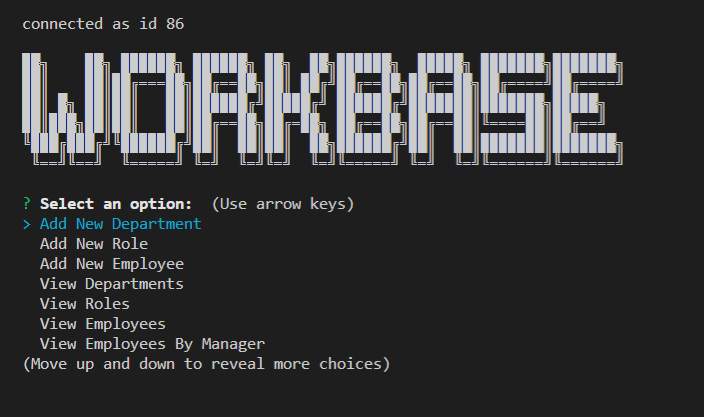

# WorkBase

---------------------------------------

## Description

This project is an iteractive database for storing employee information.  It is command-line driven and offers users the ability to create, read, update and delete entries in the three tables of the database.

The database built is named employeeDB and it holds data in the following tables:

* Employees

* Departments

* Roles

---------------------------------------

## Table of Contents
* [Installation](#installation)
* [Usage](#usage)
* [Questions](#questions)
* [License](#license)

---------------------------------------

## Installation

You must have [Node.js]("https://nodejs.org/") and [npm]("https://www.npmjs.com/") installed before you continue.

To install WorkBase, clone the repo.  Then navigate to workbase's folder in your command line/Git Bash terminal.  Once there, run `npm install`.

Next, run `node input-info.js` to input your mysql credentials.

---------------------------------------

## Usage

Navigate to your workbase folder on your PC in the command line/Git Bash - then run `npm start`.   After that, simply follow the prompts to build and play with your new WorkBase Employee Database!

* 

* [Project Demo Video](video)

---------------------------------------

Written using:

* mysql2
                    
* JavaScript
   
* Node

* figlet

* console.table

* inquirer

---------------------------------------

## Questions

For any input, concerns, bugs or questions please get in touch!  Simply reach out to [Nina Cummings](https://github.com/jaderiver62/workbase) via GitHub or via e-mail: jaderiver64@gmail.com.

---------------------------------------

## Licence

#### This project is licensed under the [MIT License](https://opensource.org/licenses/MIT).
#### &copy; 2021 Nina Cummings

---------------------------------------
    